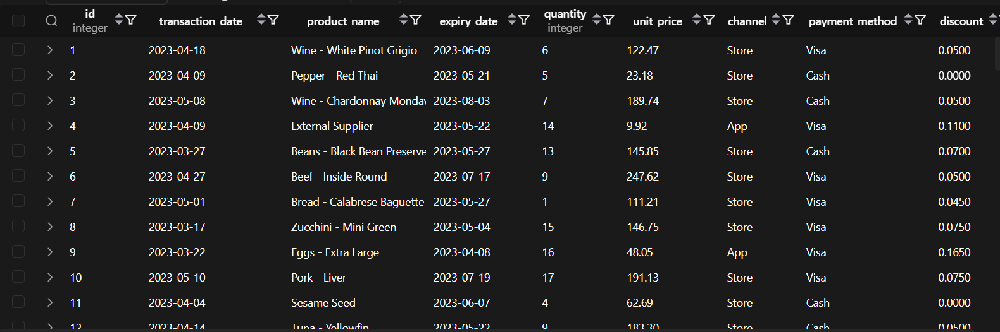

# Retail Discount Rule Engine

## Project Overview

This Scala application implements a rule-based discount engine for a retail system that processes product transactions, applies business rules to calculate discounts, and stores the results in a PostgreSQL database. The system reads transaction data from a CSV file, applies various discount rules based on product attributes, and logs all operations.

## System Architecture

### Components

1.  **Data Pipeline**:
    - CSV file reader
    - Product data mapper
    - Discount rule engine
    - Database writer
    - Logging system
2.  **Core Business Logic**:
    - Product qualification rules
    - Discount calculation rules
    - Final price computation
3.  **Infrastructure**:
    - PostgreSQL database
    - File-based logging
    - JDBC database connectivity

## Database Schema

``` sql
CREATE TABLE product_discounts (
  id SERIAL PRIMARY KEY,
  transaction_date DATE,
  product_name VARCHAR(255),
  expiry_date DATE,
  quantity INTEGER,
  unit_price DECIMAL(10,2),
  channel VARCHAR(50),
  payment_method VARCHAR(50),
  discount DECIMAL(5,4),
  final_price DECIMAL(10,4)
);
```

## Project Structure

    scala_project/
    ├── src/                 # Source files
    │   └── resources/
    │       └── TRX1000.csv  # Input data file
    ├── Docker-compose.yml   # Container configuration
    ├── joda-time-2.14.0.jar # Date/time library
    ├── postgresql-42.7.4.jar # PostgreSQL JDBC driver
    ├── rule_engine new requirements # Requirements doc Cont.
    ├── rules_engine.log     # Application log file
    ├── Scala Project.pdf    # Requirements doc
    └── scala_project.iml    # Project configuration

## Core Implementation

### Data Model

``` scala
case class Product(
  transaction_date: LocalDate,
  product_name: String,
  expiry_date: LocalDate,
  quantity: Int,
  unit_price: Double,
  channel: String,
  payment_method: String
)

case class ProductWithDiscount(
  product: Product,
  discount: Double,
  final_price: Double
)
```

### Discount Rules

The system implements the following business rules:

1.  **Expiry Discount**:
    - Products expiring in \<30 days get 1-30% discount (1% per day remaining)
2.  **Product Type Discount**:
    - Cheese: 10% discount
    - Wine: 5% discount
3.  **Special Date Discount**:
    - 50% discount for sales on March 23
4.  **Quantity Discount**:
    - 6-9 units: 5%
    - 10-14 units: 7%
    - 15+ units: 10%
5.  **Channel Discount**:
    - App purchases: 5% per 5 items (rounded up)
6.  **Payment Method Discount**:
    - Visa payments: 5% discount

### Rule Application Logic

``` scala
def getDiscountRules: List[(Product => Boolean, Product => Double)] = List(
  (isSoldWithinLast30, calcSoldWithinLast30Discount),
  (isWineOrCheese, calcWineOrCheeseDiscount),
  (isSoldOn23March, calcSoldOn23MarchDiscount),
  (isQuantityMoreThan5, calcQuantityMoreThan5Discount),
  (isSoldByApp, calcSoldByAppDiscount),
  (isVisa, calcVisaDiscount)
)
```

### Processing Pipeline

1.  Read CSV file
2.  Map to Product objects
3.  Apply discount rules
4.  Calculate final price
5.  Write to database
6.  Log all operations

``` scala
lines.map(mapLinesToProducts)
  .map(p => getQualifiedDiscountsWithLogging(p, getDiscountRules))
  .map(t => getOrderDiscountWithLogging(t._1,t._2))
  .foreach { productWithDiscount =>
    println(productWithDiscount)
    DatabaseWriter.writeProductWithDiscount(productWithDiscount)
  }
```

## Logging System

Log entries follow the format:
`TIMESTAMP:[LOGLEVEL]:MESSAGE`

Example:

    2023-05-18T14:30:45+0200:[INFO]:Processing order: Wine - Chardonnay
    2023-05-18T14:30:45+0200:[INFO]:Order: Wine - Chardonnay has qualified discounts: List(0.05, 0.05)

## Database Writer

Singleton component that handles all database operations:

``` scala
object DatabaseWriter {
  private val url = "jdbc:postgresql://localhost:5444/orders"
  
  def writeProductWithDiscount(productWithDiscount: ProductWithDiscount): Unit = {
    // Handles connection lifecycle
    // Parameterized queries
    // Error logging
  }
}
```

## Sample Data Output



## Error Handling

The system implements comprehensive error handling:
- Database connection errors
- Discount calculation warnings
- File I/O errors

## Dependencies

- Scala 2.13+
- Joda-Time 2.14.0
- PostgreSQL JDBC Driver 42.7.4
- PostgreSQL 12+ database

## Running the Application

1.  Start PostgreSQL database `Docker-compose up`
2.  Create the `product_discounts` table
3.  Place input CSV in `src/resources/TRX1000.csv`
4.  Run the main application
5.  View results in database and `rules_engine.log`

## Future Enhancements

1.  Add configuration management
2.  Implement proper connection pooling


